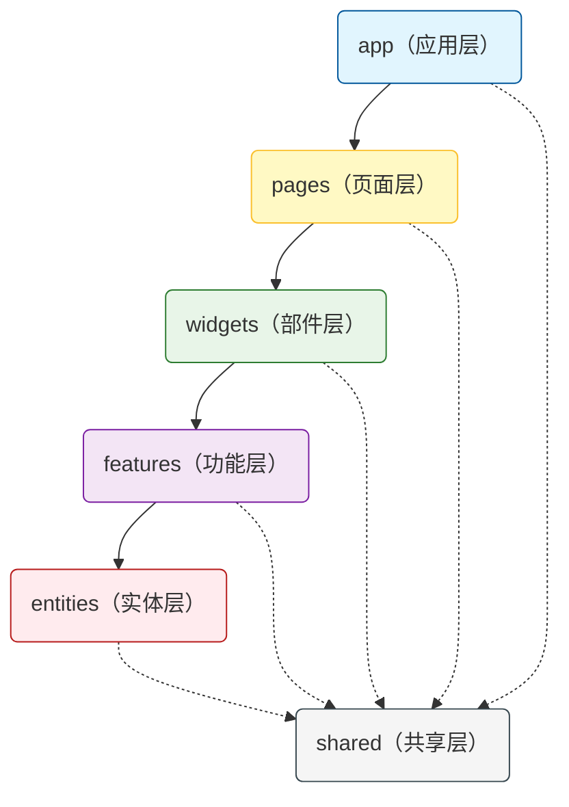
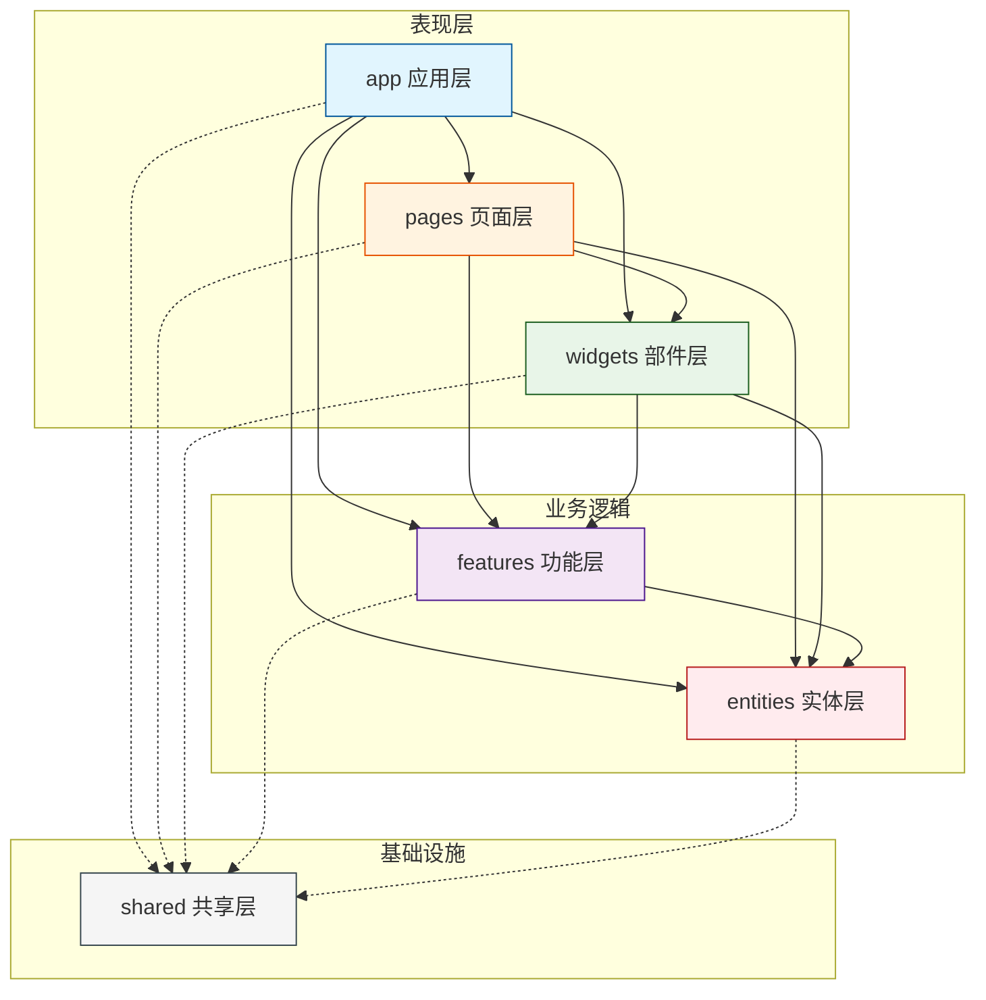
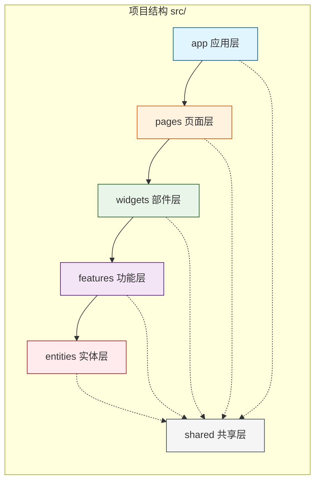

# 前端 FSD 架构笔记

## 概述

Feature-Sliced Design（FSD）是一种现代化的前端架构方法论，其核心目标是通过**标准化的规则和约定**来组织项目代码，从根本上提升代码的**可理解性**和**可维护性**，同时增强项目在面对业务需求变化时的**稳定性**。

FSD的核心理念是**围绕业务领域和功能模块（切片）进行代码组织**，取代传统的按技术角色（组件、钩子、工具函数等）分层的方式。通过定义清晰的**分层结构**和严格的**单向依赖关系**，FSD确保了架构的清晰度和稳健性。

## 架构核心

### 层次结构

FSD采用三层级结构来组织代码：**层（Layers）→ 切片（Slices）→ 段（Segments）**


### 1. 层（Layers）- 职责边界

FSD定义了六个标准层，每一层都有明确的职责范围和依赖方向：

| 层 | 职责描述 | 包含内容 |
|--------|----------|----------|
| **app** | 应用核心 | 全局配置、路由定义、Store初始化、Provider封装、全局样式 |
| **pages** | 页面组合 | 路由组件、页面布局、Widgets和Features的组合 |
| **widgets** | UI大块 | 导航栏、侧边栏、用户卡片等可复用的UI模块 |
| **features** | 用户交互 | 登录功能、购物车、评论发表等完整业务场景 |
| **entities** | 业务核心 | User、Product、Order等业务实体及其基础逻辑 |
| **shared** | 基础设施 | UI组件库、工具函数、API客户端、常量定义 |

### 2. 切片（Slices）- 业务划分

在业务相关的层（pages、widgets、features、entities）内部，按照业务领域进一步细分：

```
features/                    entities/                   pages/
├── auth/                    ├── user/                   ├── home/
├── cart/                    ├── product/                ├── profile/
├── payment/                 ├── order/                  ├── settings/
└── comment-form/            └── comment/                └── product-detail/
```

### 3. 段（Segments）- 技术职责

每个切片内部按技术角色组织代码，FSD推荐的标准段结构：

```
features/auth/               # 功能切片：用户认证
├── ui/                      # UI组件
│   ├── LoginForm.tsx
│   └── RegisterForm.tsx
├── model/                   # 业务逻辑
│   ├── store.ts
│   ├── hooks.ts
│   └── types.ts
├── api/                     # 接口请求
│   └── authApi.ts
├── lib/                     # 辅助函数
│   └── validators.ts
└── index.ts                 # 公共API出口
```

## 核心原则

### 1. 单向依赖规则

**上层可以依赖下层，下层绝不能依赖上层**，这是FSD的基石。

分层架构依赖关系图



**依赖方向详解：**
- ✅ `pages` → `features`、`entities`、`shared`
- ✅ `features` → `entities`、`shared`
- ✅ `entities` → `shared`
- ❌ `entities` → `features`、`widgets`、`pages`
- ❌ `features` → `widgets`、`pages`

这条规则确保了代码改动的**单向影响性**——底层代码的变更只会影响上层，但上层代码的变更不会波及底层，极大地降低了耦合度和回归风险。

### 2. 公共API规范

每个切片必须通过**入口文件（index.ts）**定义明确的公共API，对外暴露允许被导入的内容。

**✅ 正确方式：**
```typescript
// features/auth/index.ts
export { AuthButton, LoginForm } from './ui';
export { useAuth } from './model/hooks';
export type { User } from './model/types';
```

```typescript
// 外部导入
import { AuthButton, useAuth } from 'features/auth';
```

**❌ 错误方式：**
```typescript
// 禁止直接导入切片内部文件
import AuthButton from 'features/auth/ui/button';  // ❌
import { authStore } from 'features/auth/model/store';  // ❌
```

公共API机制相当于为每个模块提供了**受保护的外层**，重构内部代码时可以确保外部接口不变，真正做到**高内聚、低耦合**。

## 层次依赖关系图

### 完整的依赖结构



### 简洁的层级堆叠



## 最佳实践

### 切片内部结构示例

```typescript
// entities/user/index.ts - 实体层公共API
export { UserCard } from './ui';
export { useUser } from './model/hooks';
export { type User, UserRole } from './model/types';
export { userApi } from './api/userApi';
```

```typescript
// features/comment-form/index.ts - 功能层公共API
export { CommentForm } from './ui';
export { useCommentForm } from './model/useCommentForm';
```

### 依赖检查建议

1. **IDE配置**：配置TypeScript路径别名，避免相对路径混乱
2. **Lint规则**：使用 [linter](https://github.com/feature-sliced/steiger) 检查你项目的架构是否符合规则
3. **Code Review**：重点关注跨层导入是否符合单向依赖原则

### 适用场景

FSD特别适合：
- **中大型前端项目**：代码规模较大，需要清晰架构
- **长期维护项目**：多人协作，需求频繁变更
- **领域复杂项目**：业务逻辑复杂，需要明确边界

## 总结

FSD不仅仅是一套目录结构规范，更是一套**完整的前端架构方法论**。它通过：

1. **分层架构**：定义清晰的职责边界
2. **切片组织**：围绕业务而非技术进行模块划分  
3. **单向依赖**：控制代码的变更影响范围
4. **公共API**：建立模块的保护层和契约

最终实现了**高内聚、低耦合**、**可预测的依赖关系**和**业务与技术的清晰分离**，让前端项目在面对复杂业务和频繁变更时，依然能够保持清晰的结构和稳定的质量。