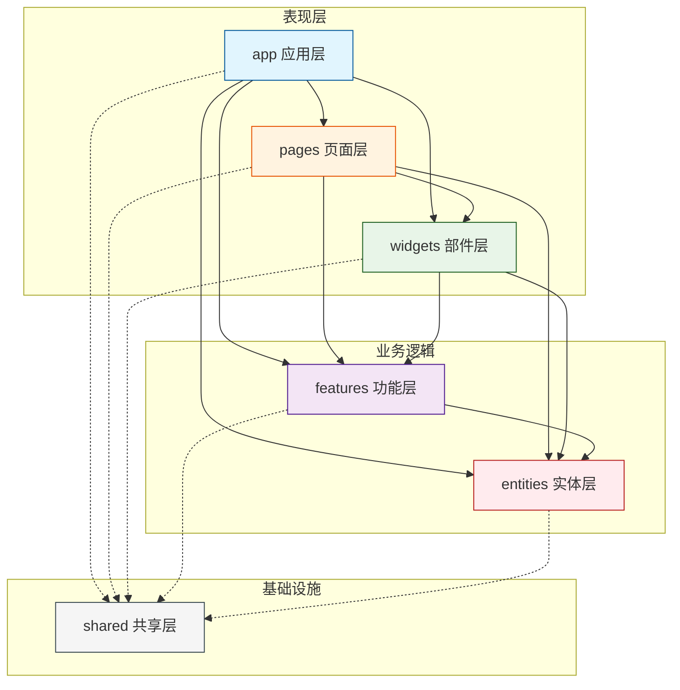
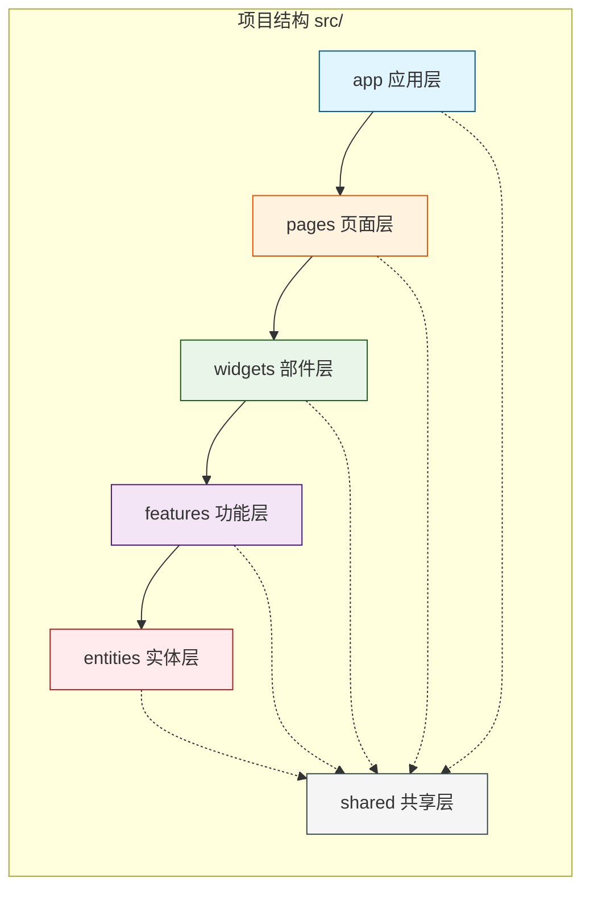

Feature-Sliced Design (FSD) 是一种用于构建前端应用的架构方法论，核心是**通过规则和约定组织代码**，旨在提升项目的**可理解性**和**面对需求变更的稳定性**。

其核心思想是**按照业务领域和功能（切片）来组织代码，而不是按照技术角色（如组件、钩子、工具函数）**，并通过清晰的**分层**和严格的**单向依赖**规则来确保架构的稳健性。

### 核心概念：3层结构

FSD 的架构基于一个清晰的层次结构：**层 (Layers) → 切片 (Slices) → 段 (Segments)**。

它们的整体结构如下：

```mermaid
graph TD
    %% 定义样式
    classDef layer fill:#f5f5f5,stroke:#333,stroke-width:2px,color:#000
    classDef slice fill:#fff,stroke:#666,stroke-dasharray: 5 5,color:#333
    classDef segment fill:#e3f2fd,stroke:#2196f3,color:#000

    subgraph FSD_Architecture [Feature-Sliced Design 项目结构]
        direction TB

        %% ========== LAYER 1: app ==========
        subgraph AppLayer [Layers: app]
            direction TB
            App[app] :::layer
            
            subgraph AppSegments [Segments]
                direction LR
                AppSegment1[providers] :::segment
                AppSegment2[router] :::segment
                AppSegment3[store] :::segment
                AppSegment4[styles] :::segment
            end
        end

        %% ========== LAYER 2: pages ==========
        subgraph PagesLayer [Layers: pages]
            direction TB
            Pages[pages] :::layer
            
            subgraph PagesSlices [Slices]
                direction TB
                
                subgraph Slice1 [Срез: home]
                    direction LR
                    HomeSeg1[ui] :::segment
                    HomeSeg2[model] :::segment
                    HomeSeg3[lib] :::segment
                end
                
                subgraph Slice2 [Срез: profile]
                    direction LR
                    ProfileSeg1[ui] :::segment
                    ProfileSeg2[model] :::segment
                    ProfileSeg3[api] :::segment
                end
                
                subgraph Slice3 [Срез: settings]
                    direction LR
                    SettingsSeg1[ui] :::segment
                    SettingsSeg2[model] :::segment
                end
            end
        end

        %% ========== LAYER 3: widgets ==========
        subgraph WidgetsLayer [Layers: widgets]
            direction TB
            Widgets[widgets] :::layer
            
            subgraph WidgetsSlices [Slices]
                direction TB
                
                subgraph WidgetSlice1 [Срез: header]
                    direction LR
                    HeaderSeg1[ui] :::segment
                    HeaderSeg2[model] :::segment
                end
                
                subgraph WidgetSlice2 [Срез: sidebar]
                    direction LR
                    SidebarSeg1[ui] :::segment
                    SidebarSeg2[model] :::segment
                    SidebarSeg3[api] :::segment
                end
                
                subgraph WidgetSlice3 [Срез: footer]
                    direction LR
                    FooterSeg1[ui] :::segment
                end
            end
        end

        %% ========== LAYER 4: features ==========
        subgraph FeaturesLayer [Layers: features]
            direction TB
            Features[features] :::layer
            
            subgraph FeaturesSlices [Slices]
                direction TB
                
                subgraph FeatureSlice1 [Срез: auth]
                    direction LR
                    AuthSeg1[ui] :::segment
                    AuthSeg2[model] :::segment
                    AuthSeg3[api] :::segment
                    AuthSeg4[lib] :::segment
                end
                
                subgraph FeatureSlice2 [Срез: comment-form]
                    direction LR
                    CommentSeg1[ui] :::segment
                    CommentSeg2[model] :::segment
                    CommentSeg3[api] :::segment
                end
            end
        end

        %% ========== LAYER 5: entities ==========
        subgraph EntitiesLayer [Layers: entities]
            direction TB
            Entities[entities] :::layer
            
            subgraph EntitiesSlices [Slices]
                direction TB
                
                subgraph EntitySlice1 [Срез: user]
                    direction LR
                    UserSeg1[ui] :::segment
                    UserSeg2[model] :::segment
                    UserSeg3[api] :::segment
                    UserSeg4[lib] :::segment
                end
                
                subgraph EntitySlice2 [Срез: post]
                    direction LR
                    PostSeg1[ui] :::segment
                    PostSeg2[model] :::segment
                    PostSeg3[api] :::segment
                end
                
                subgraph EntitySlice3 [Срез: comment]
                    direction LR
                    CommentEntitySeg1[model] :::segment
                    CommentEntitySeg2[api] :::segment
                end
            end
        end

        %% ========== LAYER 6: shared ==========
        subgraph SharedLayer [Layers: shared]
            direction TB
            Shared[shared] :::layer
            
            subgraph SharedSegments [Segments]
                direction TB
                
                subgraph SharedUI [UI Kit]
                    direction LR
                    UI1[Button] :::segment
                    UI2[Input] :::segment
                    UI3[Modal] :::segment
                    UI4[Icons] :::segment
                end
                
                subgraph SharedAPI [API]
                    direction LR
                    API1[axios] :::segment
                    API2[fetchClient] :::segment
                end
                
                subgraph SharedLib [Lib]
                    direction LR
                    Lib1[helpers] :::segment
                    Lib2[hooks] :::segment
                    Lib3[utils] :::segment
                end
                
                subgraph SharedConfig [Config]
                    direction LR
                    Config1[routes] :::segment
                    Config2[constants] :::segment
                end
            end
        end

        %% ========== 依赖关系 ==========
        AppLayer --> PagesLayer
        PagesLayer --> WidgetsLayer
        WidgetsLayer --> FeaturesLayer
        FeaturesLayer --> EntitiesLayer
        
        %% shared 被所有层依赖
        AppLayer -.-> SharedLayer
        PagesLayer -.-> SharedLayer
        WidgetsLayer -.-> SharedLayer
        FeaturesLayer -.-> SharedLayer
        EntitiesLayer -.-> SharedLayer
    end

    %% 应用样式类
    classDef layer fill:#f5f5f5,stroke:#333,stroke-width:2px,color:#000
    classDef slice fill:#fff,stroke:#666,stroke-dasharray: 5 5,color:#333
    classDef segment fill:#e3f2fd,stroke:#2196f3,color:#000
```

### 结构说明

#### 1. **Layers（层）- 最外层容器**
- `app`：应用层（全局配置、路由、store）
- `pages`：页面层（组合多个widgets）
- `widgets`：部件层（组合features和entities）
- `features`：功能层（用户交互场景）
- `entities`：实体层（业务模型）
- `shared`：共享层（UI kit、工具函数）

#### 2. **Slices（切片）- 每个Layer内部的业务模块**
- `pages/home`、`pages/profile`、`pages/settings`
- `widgets/header`、`widgets/sidebar`、`widgets/footer`
- `features/auth`、`features/comment-form`
- `entities/user`、`entities/post`、`entities/comment`

#### 3. **Segments（片段）- 每个Slice内部的技术模块**
- `ui`：UI组件
- `model`：状态管理、类型定义
- `api`：API请求
- `lib`：辅助函数
- `config`：配置项

### 特点

1. **严格的层级关系**
   - `app` → `pages` → `widgets` → `features` → `entities`
   - `shared` 作为基础设施被所有层依赖（虚线表示）

2. **切片内部结构可视化**
   - 每个业务模块（slice）都展示了其内部的技术片段（segments）
   - 不同切片可以有不同组合的片段

3. **shared层的特殊结构**
   - 没有业务切片，只有技术片段
   - 按功能分组（UI、API、Lib、Config）

更通俗的分层结构



更简洁的堆叠图



#### 层 (Layers)
层是最高层级的目录，定义了代码的职责范围和依赖方向。FSD 标准定义了以下六个层，从上到下依赖：
-   **app**：应用层。负责应用的启动、全局样式、根路由、全局状态存储和主要 Provider 的配置。
-   **pages**：页面层。根据路由组合**部件**和**功能**，构成完整的页面。这一层的代码通常是路由组件的入口，本身不包含复杂的业务逻辑。
-   **widgets**：部件层。将**实体**和**功能**组合成相对独立、可复用的UI大块，例如导航栏、侧边栏、用户资料卡片等。
-   **features**：功能层。处理完整的用户交互场景，为用户带来直接价值，例如“用户登录”、“添加商品到购物车”、“发表评论”。一个功能通常包含其特定的UI、状态管理和API调用。
-   **entities**：实体层。代表核心的业务概念或对象，例如 `User`（用户）、`Product`（产品）、`Order`（订单）。这里存放的是与实体紧密相关的数据结构和基础业务逻辑。
-   **shared**：共享层。包含完全与业务无关的、可重用的工具代码，如UI组件库（按钮、输入框）、通用工具函数（日期格式化）、API客户端配置等。

#### 切片 (Slices)
在每个业务相关的层（`pages`, `widgets`, `features`, `entities`）内部，根据具体的**业务领域或功能模块**进行进一步的划分，这些子目录就是“切片”。例如，在 `features` 层下，可以有 `features/auth`、`features/cart`、`features/payment` 等多个切片。

#### 段 (Segments)
在每个切片内部，再根据代码的**技术角色**进行划分，这就是“段”。FSD 推荐了一些常用的段名：
-   **`ui/`**：存放该切片相关的界面组件。
-   **`model/`**：存放业务逻辑、状态管理（如 Store、Hooks）、数据转换等。
-   **`api/`**：存放与后端接口交互的函数。
-   **`lib/`**：存放该切片内部使用的辅助函数或工具。
-   **`config/`**：存放该切片特有的配置项。

### 🔒 关键原则：让架构“可执行”

FSD 不仅仅是一套目录命名规范，它通过以下核心原则，让架构变得可理解和可控制：

-   **单向依赖规则**：这是 FSD 的基石。**上层可以依赖下层，但下层绝不能依赖上层**。例如，`pages` 可以引用 `features` 和 `entities`，但 `entities` 绝对不能引用 `features` 或 `widgets`。这条规则确保了代码的改动影响是单向的，极大地降低了耦合和回归风险。
-   **公共 API**：每个切片都应该有一个入口文件（通常是 `index.ts 或者切片功能名称`），作为该切片的**公共 API**，明确地向外部暴露允许被导入的内容。**禁止**从切片内部直接导入文件（例如，禁止 `import Button from 'features/auth/ui/button'`），而必须通过公共 API 导入（例如 `import { AuthButton } from 'features/auth'`）。这就像给每个功能模块加了一层保护罩，重构内部代码时不用担心影响到外部。
